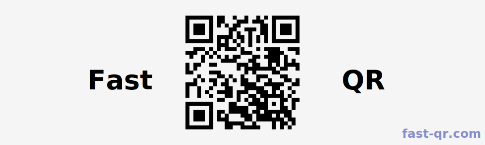

<div style="display: flex; justify-content: center">
  
</div>

`fast_qr` is approximately 6-7 times faster than `qrcode`, see [benchmarks](#benchmarks)

You can create a QR as

- [x] Raw matrix, well suited for custom usage
- [x] Vectorized image, well suited for web usage
- [x] Image, well suited for mobile / print usage

# Usage

## Rust

### Examples

You can run the examples with:

```sh
cargo run --example simple
cargo run --example svg -F svg
cargo run --example image -F image
```

They are all explained in detail below.

### Converts `QRCode` to Unicode

```rust
use fast_qr::convert::ConvertError;
use fast_qr::qr::QRBuilder;

fn main() -> Result<(), ConvertError> {
    // QRBuilder::new can fail if content is too big for version,
    // please check before unwrapping.
    let qrcode = QRBuilder::new("https://example.com/")
        .build()
        .unwrap();

    let str = qrcode.to_str(); // .print() exists
    println!("{}", str);

    Ok(())
}
```

### Converts `QRCode` to SVG [docs.rs](https://docs.rs/fast_qr/latest/fast_qr/convert/svg/index.html)

_Note: It requires the `svg` feature_

```rust
use fast_qr::convert::ConvertError;
use fast_qr::convert::{svg::SvgBuilder, Builder, Shape};
use fast_qr::qr::QRBuilder;

fn main() -> Result<(), ConvertError> {
    // QRBuilder::new can fail if content is too big for version,
    // please check before unwrapping.
    let qrcode = QRBuilder::new("https://example.com/")
        .build()
        .unwrap();

    let _svg = SvgBuilder::default()
        .shape(Shape::RoundedSquare)
        .to_file(&qrcode, "out.svg");

    Ok(())
}
```

### Converts `QRCode` to an image [docs.rs](https://docs.rs/fast_qr/latest/fast_qr/convert/image/index.html)

_Note: It requires the `image` feature_

```rust
use fast_qr::convert::ConvertError;
use fast_qr::convert::{image::ImageBuilder, Builder, Shape};
use fast_qr::qr::QRBuilder;

fn main() -> Result<(), ConvertError> {
    // QRBuilder::new can fail if content is too big for version,
    // please check before unwrapping.
    let qrcode = QRBuilder::new("https://example.com/")
        .build()
        .unwrap();

    let _img = ImageBuilder::default()
        .shape(Shape::RoundedSquare)
        .background_color([255, 255, 255, 0]) // Handles transparency
        .fit_width(600)
        .to_file(&qrcode, "out.png");

    Ok(())
}
```

## JavaScript / Typescript

### Installation

```bash
npm install --save fast_qr
# Or
yarn add fast_qr
```

### Create an svg

```js
import init, { qr_svg } from "fast_qr";
import type { QrSvgOptions } from "fast_qr";

const options: QrSvgOptions = {
  module_color: "#FFF",
  background_color: "#000",
};

/// Once `init` is called, `qr_svg` can be called any number of times
// Using then / catch:
init()
  .then(() => {
    for (let i = 0; i < 10; i++) {
      const svg = qr_svg("https://fast-qr.com", options);
      console.log(svg);
    }
  })
  .catch((e) => {
    console.error("Could not fetch wasm: ", e);
  });

// Or using modern async await:
await init();
for (let i = 0; i < 10; i++) {
  const svg = qr_svg("https://fast-qr.com", options);
  console.log(svg);
}
```

# Build WASM

### WASM module also exists in NPM registry

Package is named `fast_qr` and can be installed like so :

```
npm install --save fast_qr
```

### WASM module might be bundled

Find a bundled version in the latest [release](https://github.com/erwanvivien/fast_qr/releases).

### WASM module can be built from source

```bash
./wasm-pack.sh # Runs build in release mode and wasm-opt twice again
wasm-pack pack pkg # Creates an archive of said package
# wasm-pack publish pkg # Creates an archive & publish it to npm
```

## Benchmarks

According to the following benchmarks, `fast_qr` is approximately 6-7x faster than `qrcode`.

| Benchmark    |   Lower   | Estimate  |   Upper   |                         |
| :----------- | :-------: | :-------: | :-------: | ----------------------- |
| V03H/qrcode  | 524.30 us | 535.02 us | 547.13 us |                         |
| V03H/fast_qr | 82.079 us | 82.189 us | 82.318 us | fast_qr is 6.51x faster |
| V10H/qrcode  | 2.1105 ms | 2.1145 ms | 2.1186 ms |                         |
| V10H/fast_qr | 268.70 us | 269.28 us | 269.85 us | fast_qr is 7.85x faster |
| V40H/qrcode  | 18.000 ms | 18.037 ms | 18.074 ms |                         |
| V40H/fast_qr | 2.4313 ms | 2.4362 ms | 2.4411 ms | fast_qr is 7.40x faster |

More benchmarks can be found in [/benches folder](https://github.com/erwanvivien/fast_qr/tree/master/benches).
